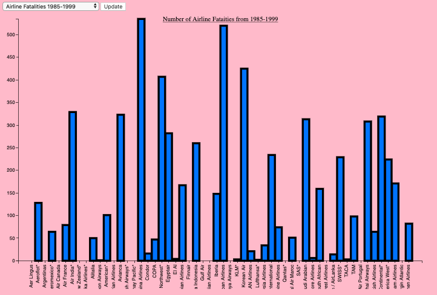

# Airline Accidents Visualization

  

## Problem Statement

Statistically speaking, flying is the safest way to travel. That being said, airplane accidents and tragedies, although unlikely, do occur and take the lives of hundreds of people in its course compared to car accidents. That is why airplane safety is of utmost importance and the airline industry needs to be continuously improved upon in regards to safety. 

## Datasets 

The dataset which the visualization is based on, shows the [number](airline.json) incidents, fatal accidents and fatalities from **1985-1999** and **2000-2014** for every major airlines in the world. 

Along with them, it also shows how many [kilometres](fatalkm.json) the airlines flew per week. 

## Instruction

1. Make sure you have `python3` installed
2. Clone this repository by typing this on your terminal or command line `git clone https://github.com/kellypham/Airline-Accidents-Visualization.git`
3. Move into the directory `cd Airline-Accidents-Visualization`
4. Run the application `python3 -m http.server 8080`
5. Open your browser and go to `http://0.0.0.0:8080/`

Note: recommended browser is **Google Chrome**

## Demo

  

A demonstration can be found at this [link](https://www.youtube.com/watch?v=f5v8siK6sGU&feature=youtu.be).

## Related Work

- [PlaneTruth](http://www.informationisbeautiful.net/visualizations/plane-truth-every-single-commercial-plane-crash-visualized/)

  

## Author

- Sumeet Dhillon
- Muhammad Ansari
- Kelly Pham
